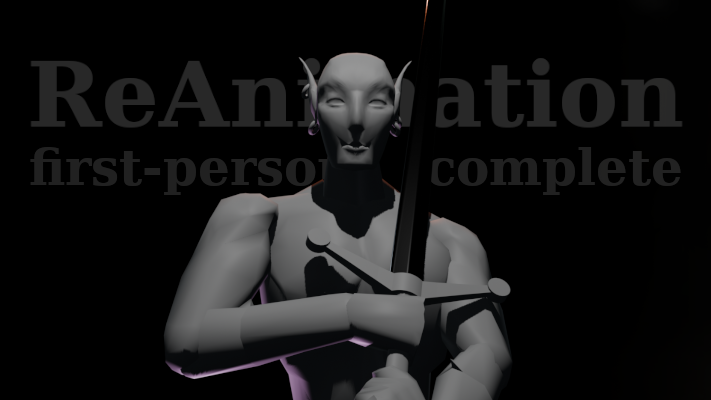
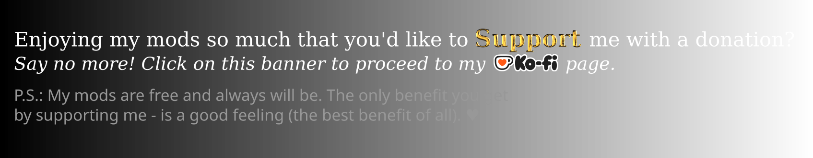
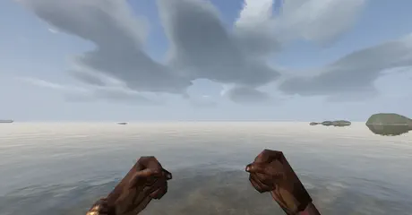
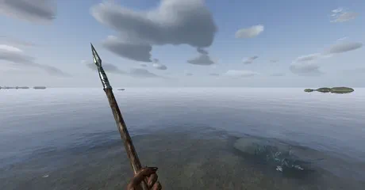
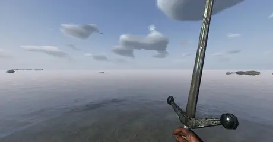
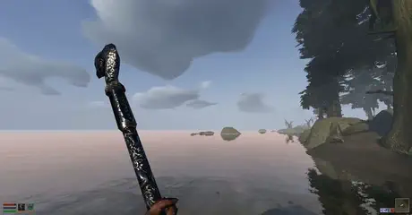
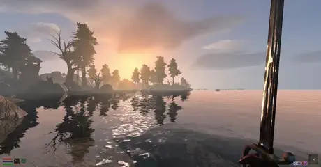
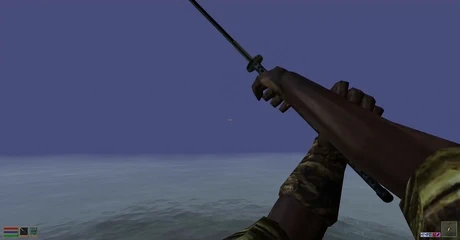
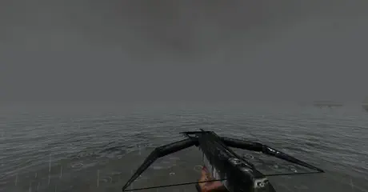
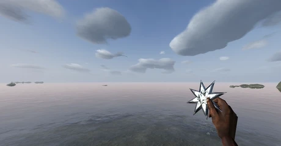

# 𖤝 ReAnimation - first-person - v3: Complete


An immersive reimagining of the TES3: Morrowind 1st-person animations. Punch, slash, chop, shoot and _thrust_ your way through vvardenfell with style! 

Absolute most animations are remade from scratch and many more animations are added to break up the repetative attack animation spam. Furthermore some weapon subtypes received few additional unique animations (shortblades and katanas).

Overall twice as much animation juice as the original game.

Developed for OpenMW engine. **Requires OpenMW 0.51+**.

## 𖤝 Check out my cool donation banner

I also have a cool donation banner now:

<p><a href="https://ko-fi.com/maxyari"></a><a href="https://ko-fi.com/maxyari"></a><br><a href="https://ko-fi.com/maxyari"></a></p>

Thank you for being around, and have fun :) 

## 𖤝 Appreciation

Thanks to [fallchildren](https://github.com/fallchildren2) for code contributions and motivating me to expose a (somewhat) proper API.

Thanks to [taitechnic](https://forums.nexusmods.com/profile/193965921-taitechnic/) and [S3ctor](https://github.com/magicaldave) for the code contribution and optimisation help.

My thanks go to OpenMW discord community for massively helping me overcome a multitude of Lua hurdles, testing and providing feedback, with a special thanks to [SPITSFIRE](https://www.nexusmods.com/profile/SPITSPHIRE/mods) for discovering and investigating a number of v3 issues.

## 𖤝 A lot of gifs

That show _some_ of the animations. (Give them some time to load)











## 𖤝 How to install

**Requires OpenMW 0.51+**

1) Install the dependency [Max Yari's Script Services](https://github.com/MaxYari/MaxYarisScriptServicesOpenMW) (Most of my lua mods require it now)
1) Install this mod **With a mod organiser**: Download this repository as an archive and drag and drop it into your mod organiser of choice (e.g [Mod Organizer 2](https://github.com/ModOrganizer2/modorganizer/releases) on Windows or [Nerevarine Organizer](https://github.com/grazelandsnomad/nerevarine_organizer/releases/tag/v0.70) on Linux).  
**Or**: [read this tutorial](https://modding-openmw.com/tips/installing-mods/) on how to install mods using the launcher or completely manually (it's also very easy). 

2) Enable the mod's .omwscript files in "Content Files" tab of the OpenMW launcher ( `ReAnimation_API` and `ReAnimation_v3` at the time of writing). 

3) OpenMW Launcher -> Settings -> Visuals -> Animations: "Use Additional Animation Sources" and "Smooth Animation Transitions" must be enabled!

4) _VERY OPTIONAL_: Setting your view-model (1st-person model) field of view to a higher value makes the first person experience a bit more exciting, note this is not the same as field of view in game settings, you can find how to change it in this [reddit post](https://www.reddit.com/r/OpenMW/comments/1i2dl4r/anyway_to_change_viewmodel_fov/). Try a value of 75 or 70.

4) ... ???

5) PROFIT (Play)

*NOTE #1*: In Morrowind Mod Organiser you might see a dialog box with a "The contents of <data files> does not look valid" error, this is fine and expected, Mod Organiser is just not aware of how additional animations work in OpenMW, you can safely press OK without changing anything.

*NOTE #2*: OpenMW camera 1st person head-bob (the one that can be enabled in scripts in-game) may slightly conflict with the walk cycle animation, it's not too bad, but the mod was developed assuming that setting is turned off.

*NOTE #3*: If you _only_ want to use ReAnimation as an API  for another mod (i.e only as a dependency that doesnt add any animations on its own) - only enable `ReAnimation_API` AND delete "Animations" folder from within this mod.

## 𖤝 Mod suggestions

[Dynamic Camera](https://www.nexusmods.com/morrowind/mods/55327) for more dynamic first person camera and visual effects. "Trust me bro" its not some annoying head bob - its subtle, tasteful and makes the experience feel more polished.

[Dynamic Reticle](https://www.nexusmods.com/morrowind/mods/56584) mostly for hit markers to make hits (especially marksman ones) more impactfull.

If you would like NPCs to also have alternating attack animations - try [3rd Person Alt Attacks](https://modding-openmw.com/mods/3rd-person-alt-attacks/) by [fallchildren](https://github.com/fallchildren2) (These animations are made in a different style and dont exactly match mine, but you might enjoy them)


## 𖤝 Mod compatibility

Compatible with practically any other animation mod. ReAnimation uses OpenMW system of animation overrides and will only override a specific set of animations. Recommended to use with [MCAR](https://www.nexusmods.com/morrowind/mods/48628) for delightfull swimming and casting animations, but will work just fine without it. MCAR should be situated in a load order before ReAnimation.

[Better Bodies](https://www.nexusmods.com/morrowind/mods/48387) (while not wearing shoulder armor) and maybe other body replacers, as well as some custom modded shoulder armors or full body armors - all display a sharp protruding polygon at on the left side of the screen while sneaking with a dagger. This seem to be more of an asset issue and/or a general messed up way how sneak works under the hood (by essentially dislocating character's neck). _I THINK_ (I havent tested it myself because im lazy) using [Smooth first-person Sneak for OpenMW](https://www.nexusmods.com/morrowind/mods/55241) should completely fix the issue.

[Full Body Awareness](https://www.nexusmods.com/morrowind/mods/56625) is currently not supported but a compatible version or ReAnimation is in the works (I hope im not jinxing it)


## 𖤝 Vanilla/MWSE compatibility

Only v1 version of this mod (far fewer animations in comparison to v3, no alternating attacks e.t.c) is available for vanilla Morrowind, you can find v1 in the downloads section on nexus.

v3 is not currently compatible. If you would like to port the scripting part to MWSE - please do, I'm not familiar with MWSE and am not planning to change that.
However, if possible - keep this mod as a dependency, instead of reuploading the whole thing.

## 𖤝 For Modders

Let me preface this by saying that the text below is 75% human written but then never properly proof-read or checked for spelling, and the rest of 25% is AI slop-generated. Nevertheless it should contain all the information you might need, sorry if its too annoying to read :)

### Basics

ReAnimation exposes an API (Interface for other mods to use). The interface works around some of the OpenMW Lua animation API limitations and provides a simple way of adding alternating attack animations for different weapons, as well as a slightly less simple way of defining generic conditional animation overrides.

To ensure that the ReAnimation interface is available, your mod should either be loaded after the ReAnimation API, or you should interact with the interface from inside the update function instead of the global scope. But in the latter case, ensure that you register your animations/overrides only once, and not every update tick.

#### Attack variants

Is a way to register alternating ("alt" below) and substitute ("sub" below) attack animations. Alternating attadcks play in alternating (duh) fashion, while sub attacks are a random replacement of an attack animation. As a simple example - you might have 2 variants of a downward chop animations and 1 variant of upward swing, you want downchop to always be followerd by up swing, but you also want a random chop to be used every time for your down chop. In this example your chop variants are sub attacks while your upward swing is an alt attack. Below example setups exactly this kind of scenario for two-handed chops.

```Lua
local I = require('openmw.interfaces')

I.ReAnimation.addAttackVariants({
    id = "MyTwoHandAttacks",                  -- optional, for removeAnimationOverride
    parentAttackGroupname = "weapontwohand",
    armatureType = I.ReAnimation.ARMATURE_TYPE.FirstPerson,
    subAttackMode = I.ReAnimation.SUB_ATTACK_MODE.Random,  -- or RoundRobin
    condition = function() return not I.ReAnimation.isEquippedWeapon("katana") end, -- optional
    attacks = {
        chop   = { { "weapontwohand", "weapontwohandsub" }, { "weapontwohandalt" } },
        slash  = { { "weapontwohand" }, { "weapontwohandalt" } },
        thrust = { { "weapontwohand" }, { "weapontwohandalt" } },
    },
})
```
heare "weapontwohand", "weapontwohandalt" and "weapontwohandsub" are names of animation groups to which your attack animations belong. I.e for chops: vanilla chop is stored in weapontwohand, alt chop is stored in weapontwohandalt group (which i simply made up) and, similarly, sub chop is stored in weapontwohandsub. It IS important that all extra attack animations belong to their own groups distinct in name from the vanilla attack group and each other. It is fine to keep different attack types (chop/slash/thrust) under the same groupname as it is done in the example above.

Here's also an AI slop summary in case I missed something since I dont even want to bother re-reading the things that I wrote above:
- **The outer list alternates.** Attacks of one type step through it in order, so a single step means no alternation. If that attack type isn't used for `sequenceResetTime` seconds (default 3), the sequence starts over from the first step.
- **The inner list holds interchangeable variants.** `subAttackMode` picks one per attack: `Random` (the default; `randomMaxRepeats`, default 3, caps how often the same one comes up in a row, and 0 removes the cap) or `RoundRobin` (in the listed order).
- **Listing the parent group itself plays the vanilla animation**, so vanilla can be one of the options. Attack types you leave out are not touched.
- **`condition` gates the whole set**, e.g. by the equipped weapon (`isEquippedWeapon`, `getEquippedWeaponId`). Several sets can share one parent group, as long as their conditions are never true at the same time.
- **Text key timings must match the parent's exactly**, the same as for alt attacks: a variant plays on top of the hidden vanilla attack, whose keys still trigger hits and move the attack through its stages.

#### Tails

Essentially an extra part of an attack animation that plays after follow stop (if present). It does not affect gameplay and can be interrupted by starting another attack, but it allowes to make the attack animation ending transition as long and as beautiful as you want it.

 ReAnimation looks for a group named `<attack group>extra` with a `<Type> Tail Start` and `<Type> Tail Stop` key, and plays that section if both exist. For example, `weapontwohand`'s chop plays the `Chop Tail Start` to `Chop Tail Stop` section of `weapontwohandextra`. Variant groups get their own, so `weapontwohandsub` uses `weapontwohandsubextra`.

For a seamless transition between the follow stop and tail, it is recommended to bundle this blend rule alongside your .kf file:

```yaml
blending_rules:
  - from: "*:*follow start"
    to: "*:*tail start"
    easing: "linear"
    duration: 0
```

If you dont know what "blend rules" even mean, honestly - don't bother, you probably will not notice that anything is wrong with the transition.

#### Generic conditional animation override:

```Lua
local I = require('openmw.interfaces')

I.ReAnimation.addAnimationOverride({
    id = "myDaggerSneakOverride"
    parent = "idle1s",
    groupname = "idle1ssneak",
    armatureType = I.ReAnimation.ARMATURE_TYPE.FirstPerson,
    stance = I.ReAnimation.STANCE.Weapon,
    condition = function(self)
        return omwself.controls.sneak
    end,
    stopCondition = function(self)
        return not self:condition()
    end,
    options = function(self)
        local opts = cloneAnimOptions(self.parentOptions)
        opts.loops = 999
        opts.priority = self.parentOptions.priority + 1
        return opts
    end,
    startOnUpdate = true
})
```
This registers a special "idle1ssneak" idle animation that will play whenever the vanilla "idle1s" animation is playing AND the character is in sneak mode. 

`parentOptions` and the return value of the `options` method are of the same format as [playBlended options parameter](https://openmw.readthedocs.io/en/latest/reference/lua-scripting/openmw_animation.html##(animation).playBlended). 

This is a very raw override method that can barely be considered a properly polished API. It provides a lot of flexibility but also requires some understanding of how the OpenMW animation API functions. The best way to use this method is to pick one of the override definitions from AnimationOverrides.lua as a base for your own.

Added overrides can be removed using 
```Lua
I.ReAnimation.removeAnimationOverride("my_override_id")
```
Where `my_override_id` is an id you provided to the override in `addAnimationOverride` (if you provided such an id at all).

## 𖤝 AI Disclaimer

During v3 development Claude Code was used heavily for essentially automating and simplfying evering around animation production which is not animation production itself: e.g developing scripts, finding info in the OpenMW source code and archives, improving the animation toolset, improving and optimising the API. Despite all the obvious ethical and enviromental concerns that come with AI use, truth be told, without the ability to offload absolute tons of tedium to an AI - I dont think this update would ever been possible.

🤖 Clank clank.


